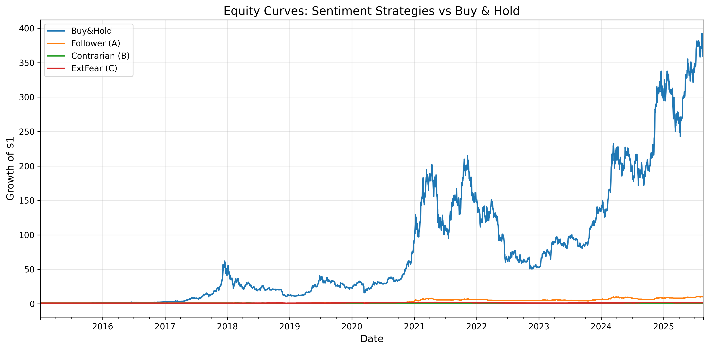
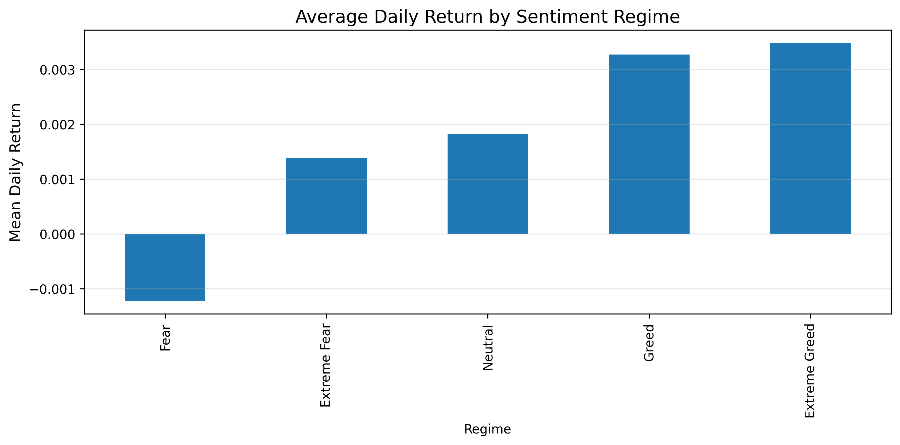
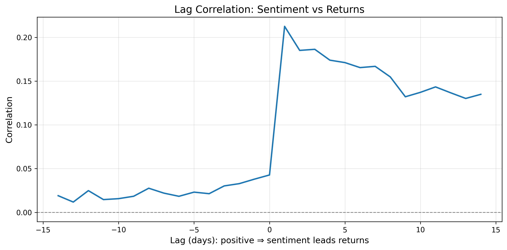

# Bitcoin Fear & Greed Index Analysis

## Project Overview

This project analyzes the relationship between the Bitcoin Fear & Greed Index and Bitcoin price movements from 2015 to 2025. The analysis investigates whether sentiment indicators can be effectively used for Bitcoin trading strategies and explores the statistical relationships between market sentiment and price returns.

## Data Sources

- **Bitcoin Price Data**: Historical BTC-USD price data from 2015-01-01 to 2025-08-20, obtained via yfinance
- **Sentiment Data**: Fear & Greed Index daily values from `csv_files/fear_greed_index.csv`

## Analysis Performed

1. **Data Processing**
   - Loaded and cleaned Bitcoin price data and Fear & Greed Index data
   - Created lagged sentiment indicators to avoid look-ahead bias
   - Normalized sentiment classifications into numeric scores

2. **Trading Strategies**
   - **Strategy A (Follower)**: Go long when sentiment is Greed (≥50), otherwise flat
   - **Strategy B (Contrarian)**: Go long when sentiment is Fear (≤50), otherwise flat
   - **Strategy C (Extreme Fear)**: Go long only during extreme fear (z-score < -1), otherwise flat
   - **Benchmark**: Buy & Hold strategy

3. **Performance Analysis**
   - Calculated key metrics: CAGR, Volatility, Sharpe ratio, Max Drawdown, Hit Rate
   - Analyzed conditional returns by sentiment regime
   - Examined lead/lag relationships between sentiment and returns
   - Performed statistical tests to compare strategy performance

## Key Findings

The performance results (from `strategy_performance_summary.csv`) show:

- **Buy & Hold** delivers the highest CAGR at 74.0%, with a Sharpe ratio of 1.16
- Among sentiment strategies, the **Follower** strategy performs best with 24.0% CAGR
- **Contrarian** and **Extreme Fear** strategies underperform the market
- **Statistical significance**: T-tests confirm that all sentiment strategies significantly underperform Buy & Hold

Sentiment regimes show varying average returns (from `conditional_returns_by_regime.csv`):

- Higher returns tend to occur during "Extreme Greed" periods
- Lower returns tend to occur during "Fear" periods
- This relationship suggests some predictive value in sentiment

## Visualizations

The output folder contains visualizations of the analysis:

1. 
   **EquityCurve_highres.png**: Performance comparison of all strategies
2. 
   **ConditionalReturns_highres.png**: Average daily returns by sentiment regime
3. 
   **LagCorrelation_highres.png**: Correlation between sentiment and returns at different lags

## Output Files

All results are stored in the `output` folder:

- **panel_sentiment_price.csv**: Combined dataset of Bitcoin prices and sentiment indicators
- **strategy_performance_summary.csv**: Performance metrics for all trading strategies
- **conditional_returns_by_regime.csv**: Average returns by sentiment regime
- **lag_correlation_sentiment_vs_returns.csv**: Correlation values at different lags
- **Bitcoin_Fear_Greed_Analysis.html**: Complete notebook exported as HTML for easy sharing

## Conclusions

1. **Market Efficiency**: The Bitcoin market appears relatively efficient with respect to sentiment information, as simple sentiment-based strategies underperform Buy & Hold
2. **Sentiment Signals**: There is a statistical relationship between sentiment and returns, but exploiting it for excess returns is challenging
3. **Strategy Implications**: Following extreme sentiment readings may provide entry points, but timing the market based solely on sentiment is difficult

## How to Run

1. Ensure you have the required packages: `yfinance`, `pandas`, `numpy`, `matplotlib`, `scipy`, `scikit-learn`, `statsmodels`
2. Run `Notebook_1.ipynb` to reproduce the analysis
3. Results will be saved to the `output` folder

## Future Work

- Incorporate additional sentiment indicators beyond just Fear & Greed Index
- Explore machine learning approaches that combine sentiment with price-based features
- Test more sophisticated trading rules with dynamic position sizing
- Extend analysis to other cryptocurrencies beyond Bitcoin
